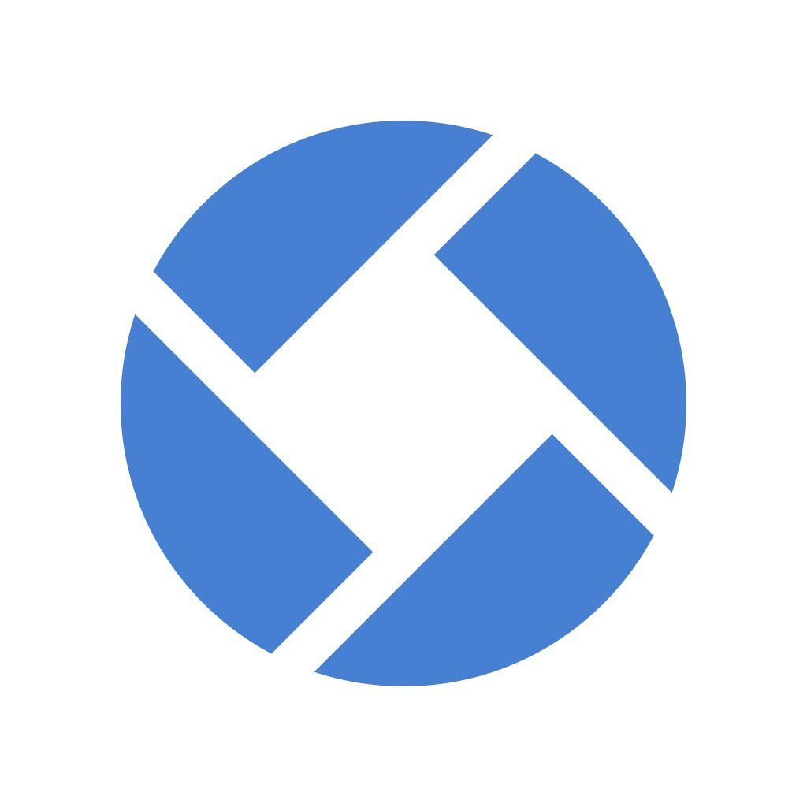

<b> CtradeExchange <i>digital currency, foreign exchange, stock trading , spot matching</i></b>

----

# trade-system
> English | [中文](README_zh.md)

Open source digital currency, foreign exchange, stock trading system, support a variety of trading methods, spot matching, contract full position, contract isolated position, leveraged spot, stock, foreign exchange, etc.

# List of functions:

- Support multiple trading strategies: contract, leverage, spot, and risk hedging (single-shot trading mode)
- Rich open interfaces, convenient and fast access to mainstream payment systems and rapid development of business promotion activities
- Multiple client support (H5, PC, APP), rich market icons, multiple indicators
- Powerful background management, support the main white label mode, and realize the simultaneous development of multiple business modes
- Flexible parameter configuration capabilities, various transaction parameter configurations take effect in real time
- Stable market structure, supporting mutual backup of multiple sources (coinapi, binance, ib, ig, longbridge, etc.)

# Features:
- Client
- Management background

# Main technique:

## Backstage:
- Development framework: Spring Boot 2.7
- Microservice Framework: Spring Cloud 2021
- Security framework: Spring Security + Spring OAuth 2.0
- Task scheduling: Quartz, Saturn
- Database support: MySQL, PostgreSQL, MongoDB, TiDB, influxDB
- Persistence layer framework: MyBatis && MyBatis Plus
- Database connection pool: Druid
- Service registration and discovery: Nacos
- Client load balancing: Spring Cloud Loadbalancer
- Fuse component: Sentinel
- Gateway component: Spring Cloud Gateway
- Log management: Logback
- Running container: Undertow
- Distributed transactions: LCN, Seata
- Workflow: Activiti 5.22
- Data synchronization: Canal
- Message middleware: Kafka, RocketMQ
- In-memory database: Ignite
- Matching engine: Exchange-core
- Lock-free queue: LMAX Disruptor
- Risk control rule engine: Drools
- Transaction communication protocol Netty + Dubbo
- Market communication protocol TCP + PB

## front end:
- JS framework: Vue, Avue, nodejs
- CSS framework: sass
- Component library: ElementUI
- Package build tool: Webpack
- Client Uniapp

# Service definition:
Service Description

# Overall structure:
texture map

# Core process:
Flow chart, Supplemental English version
